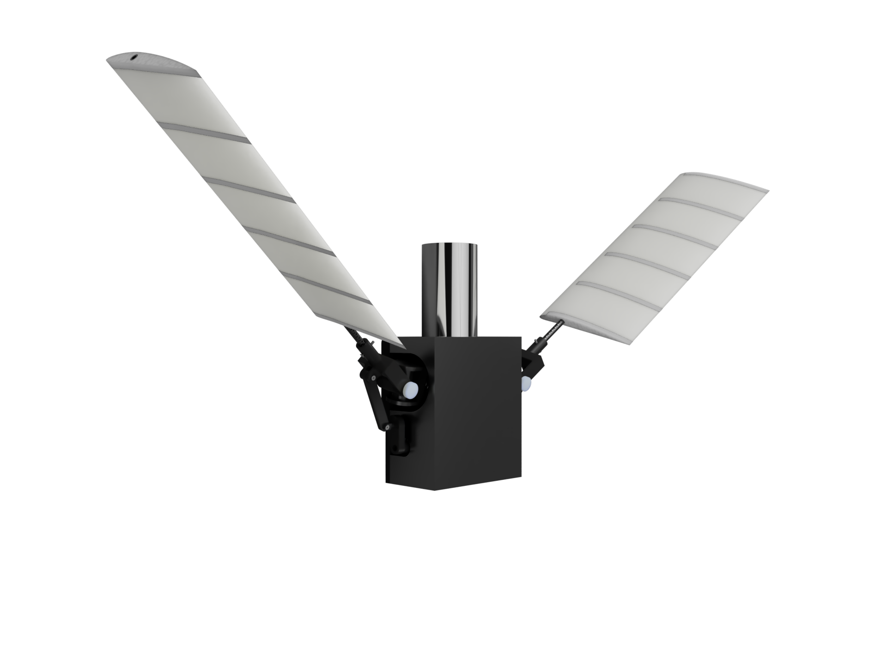
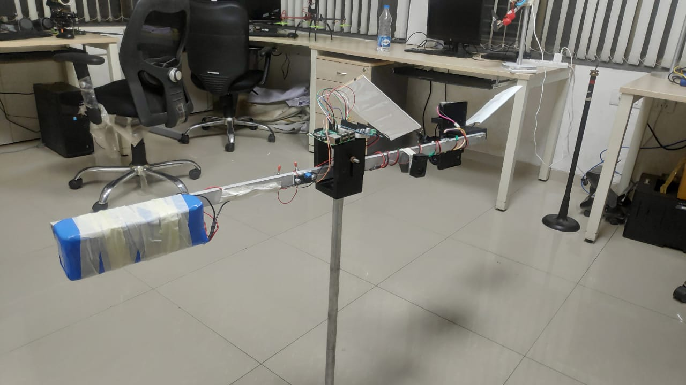

# Flapping Wing Mechanism

<i> This is a repository for the analysis and processing of a mechanically-coupled flapping and feathering mechanism, designed as a 2 degree-of-freedom working model at the <a href="https://sites.google.com/iitb.ac.in/lama-iitb-syscon/">LAMA lab</a>.</i>
 

 
 

 
The mathematical modeling on flapping wing aerodynamics <a href="https://nonlinearstudies.com/index.php/mesa/article/view/2269">here</a>, by A. Paranjape, et.al., has been used to develop the controller for stabilization and trajectory tracking. Experimental results from our model (shown below), match the predicted behavior in literature. We are currently working on upgrading the model to a working prototype.

